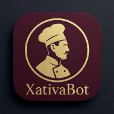

<<<<<<< HEAD
# XativaBot PWA

Asistente culinario para los restaurantes Xativa, con reservas vía WhatsApp, información histórica de alimentos, juego de sopa de letras culinaria, interacción por voz y multilenguaje (incluyendo francés).

## Características principales
- **Reserva directa por WhatsApp**: El usuario rellena el formulario y la reserva se envía automáticamente al WhatsApp del restaurante. Opción de enviarse copia a su propio WhatsApp.
- **Juego culinario**: Sopa de letras de 15x15 con 15 palabras, estadísticas, histórico persistente y reinicio.
- **Interacción por voz**: Entrada y salida de voz en varios idiomas.
- **Internacionalización**: Español, inglés, catalán y francés.
- **PWA**: Instalación en dispositivos móviles y escritorio, soporte offline.

## Instalación y despliegue

### 1. Clonar el repositorio
```sh
git clone https://github.com/VictorAvilan/xativabot-pwa.git
cd xativabot-pwa
```

### 2. Instalar dependencias (si usas Netlify/Vercel)
```sh
npm install
```

### 3. Servir localmente
Puedes usar cualquier servidor estático, por ejemplo:
```sh
npx http-server .
```
O con Live Server en VS Code.

### 4. Despliegue en GitHub Pages
- Sube todos los archivos a la rama `main` o `gh-pages`.
- Entra en **Settings > Pages** y selecciona la rama y carpeta raíz.
- Accede a la URL pública que te da GitHub.

### 5. Despliegue en Netlify/Vercel
- Conecta el repo y selecciona la carpeta raíz.
- El build es estático (`public` o raíz).

## Configuración de WhatsApp
- Cambia el número de WhatsApp del restaurante en el archivo `app.js` (busca `restaurantPhone`).
- El usuario puede recibir copia si pone su número en el formulario.

## Estructura del proyecto
- `index.html` — Página principal y chat.
- `app.js` — Lógica de la app, reservas, voz, internacionalización.
- `xativa-game.html` — Juego de sopa de letras.
- `styles.css` — Estilos generales.
- `netlify/functions/` — Funciones serverless para reservas y conocimiento.
- `data/` — Menú, historia y temporadas.

## Créditos
- © 2023-2025 Xativa Restaurants / Victor Avilan
- Iconos e imágenes: propios y libres de derechos.

---

¿Dudas o sugerencias? Abre un issue o contacta a Victor Avilan.
=======
# XativaBot PWA



A Progressive Web Application featuring an AI-powered chef assistant for Xativa restaurants with voice interaction capabilities, multilingual support, and elegant design.

## Features

- **Voice Interaction**: Natural conversation with speech recognition and synthesis
- **Multilingual Support**: Available in English, Spanish, and Catalan
- **PWA Capabilities**: Installable, works offline, push notifications
- **Elegant UI**: Luxury restaurant styling with responsive design
- **Chef Assistant**: Menu recommendations, dietary information, reservations
- **Mobile Optimized**: Full functionality on all devices

## Installation

### Prerequisites

- Node.js (v16 or higher)
- npm (v8 or higher)

### Setup

1. Clone the repository:
>>>>>>> 337b8ebf236036d6c60b58441d582b11fcb9875f
